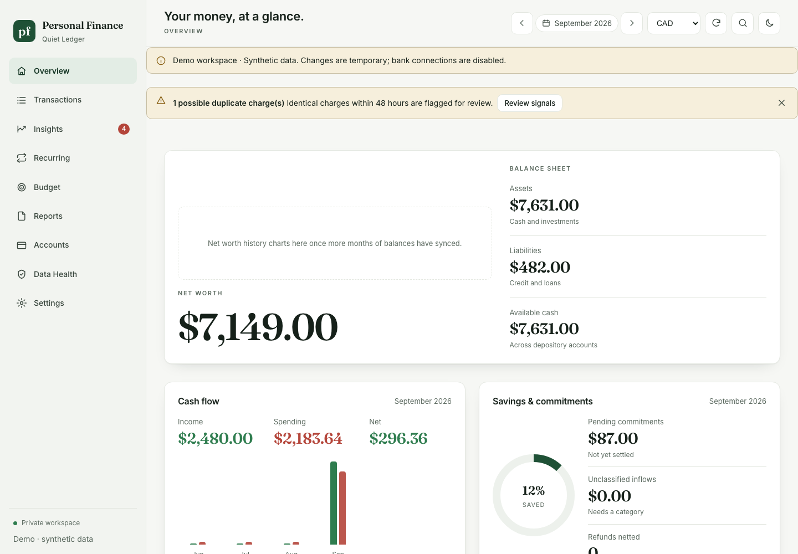
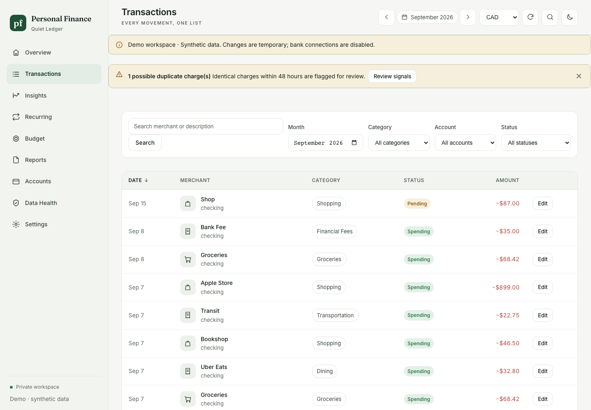
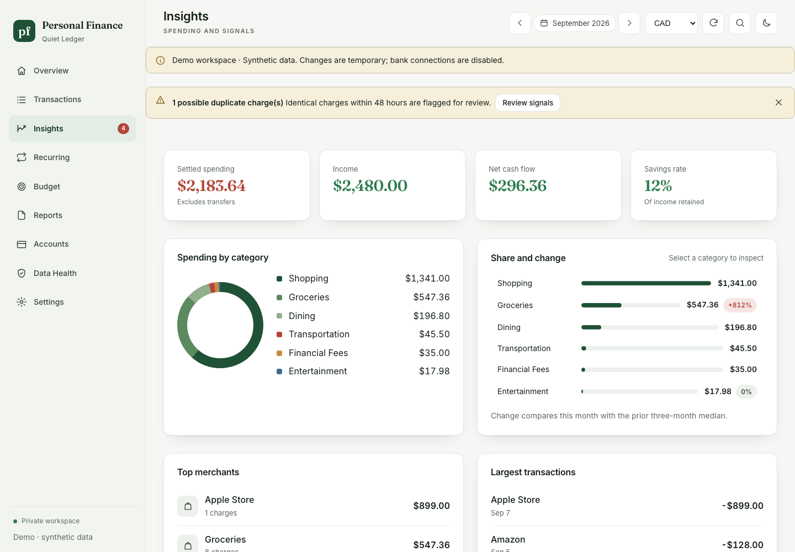
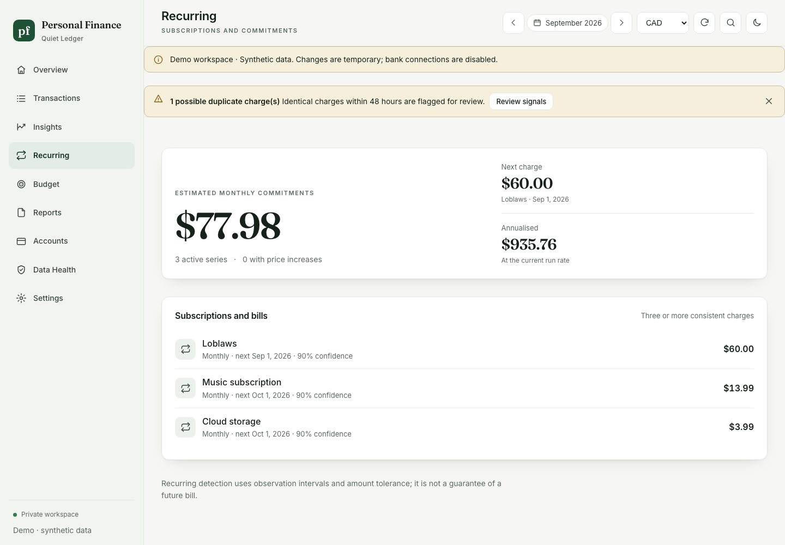
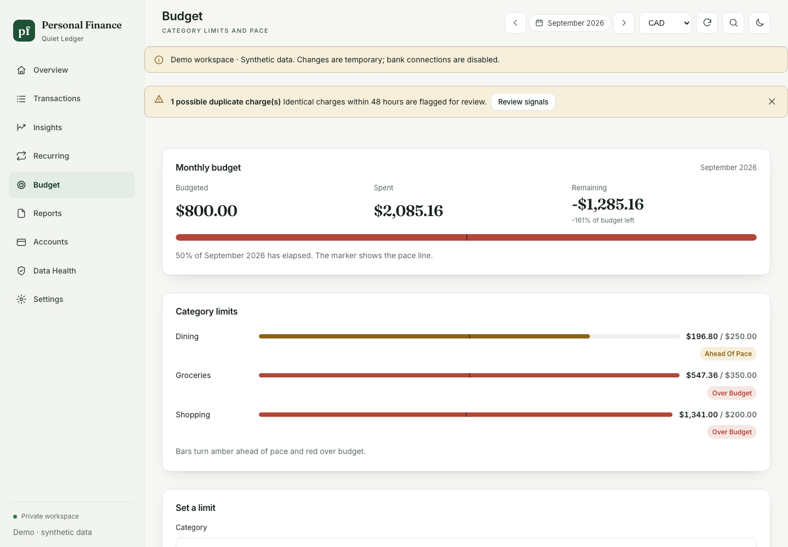
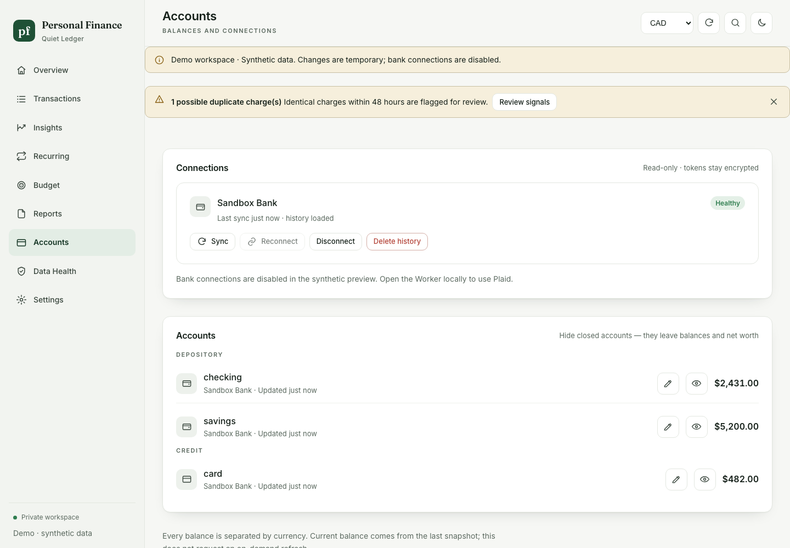

# Personal Finance

A private, single-owner personal finance Worker: Plaid ingestion → D1 source records → deterministic classification and analytics → dashboard and OAuth-protected MCP.

**Implemented locally; not deployed or connected to a real bank.** No credentials or personal data are included. Real GitHub OAuth, Plaid Sandbox/Production, and remote Cloudflare resources must be configured before live acceptance testing. The optional live Plaid test is skipped unless explicitly enabled.

**Bring your own Plaid:** follow [Connect your own Plaid banking data](docs/plaid-setup.md) for the free Sandbox/Trial setup, GitHub owner gate, Cloudflare resources, secrets and deployment. The repository ships with placeholder infrastructure IDs only.

## Screenshots

Captured from `pnpm demo` with synthetic data. No real accounts.

| Overview                                                                                   | Transactions                                                                   |
| ------------------------------------------------------------------------------------------ | ------------------------------------------------------------------------------ |
|  |  |
| **Insights**                                                                               | **Recurring**                                                                  |
|                             |      |
| **Budget**                                                                                 | **Accounts**                                                                   |
|                             |           |

## Run locally

Requires Node 24+ and pnpm 11.19.0.

```sh
pnpm install --frozen-lockfile
pnpm db:migrate
cp apps/finance-worker/.dev.vars.example apps/finance-worker/.dev.vars
# Fill the local secrets described below.
pnpm dev
```

Open http://localhost:8787. With no secrets, the sign-in screen and `/health` work; financial APIs and MCP remain protected. There is no production or development authentication bypass.

Create a GitHub OAuth App with homepage `http://localhost:8787` and callback `http://localhost:8787/callback`. Set `OWNER_GITHUB_ID` to your **numeric, immutable GitHub account ID**. Configure `GITHUB_CLIENT_ID` and `GITHUB_CLIENT_SECRET` from that app. Use a separate OAuth app for deployed environments.

Set `PLAID_CLIENT_ID` and the **Sandbox** `PLAID_SECRET` for local development. Generate two independent 32-byte base64 keys with `openssl rand -base64 32`, placing them in `TOKEN_ENCRYPTION_KEY` and `COOKIE_ENCRYPTION_KEY`. Never use a Production Plaid secret locally. These files are gitignored.

Sign in, open Connections, and connect with Plaid Link. Local webhooks cannot be reached by Plaid; use Sync on the Connections screen or `pnpm backfill`. `pnpm db:seed` optionally creates one real Plaid **Sandbox** test Item directly; repeated runs refuse to create duplicates. It requires the same local secrets.

After sign-in, the owner is sent to `/setup` until the workspace is ready. The setup portal checks GitHub OAuth, encryption keys, Plaid credentials, D1 connectivity and schema, the job queue, and active bank connections without returning secret values. It can open Plaid Link and refresh the checks; secrets still belong in Wrangler or `.dev.vars`, and migrations remain an explicit deployment step:

```sh
pnpm db:migrate
pnpm exec wrangler secret put GITHUB_CLIENT_ID --env sandbox -c apps/finance-worker/wrangler.jsonc
pnpm exec wrangler secret put GITHUB_CLIENT_SECRET --env sandbox -c apps/finance-worker/wrangler.jsonc
pnpm exec wrangler secret put PLAID_CLIENT_ID --env sandbox -c apps/finance-worker/wrangler.jsonc
pnpm exec wrangler secret put PLAID_SECRET --env sandbox -c apps/finance-worker/wrangler.jsonc
```

## Preview without credentials

Run `pnpm demo` and open http://localhost:4173. This uses an isolated in-memory database of clearly labelled synthetic transactions. It supports dashboard exploration and temporary metadata edits; bank connections are disabled. It is not bundled into the Worker.

## Verify

```sh
pnpm typecheck
pnpm test           # financial, SQLite, sync, webhook, session and actual MCP protocol tests
pnpm build          # React production build + Worker dry-run, never deploys
pnpm test:worker    # HTTP checks against an already-running localhost Worker
pnpm integrity     # reconcile local D1 aggregates
```

A live provider test is available separately. Export Sandbox credentials in your shell, then run `RUN_PLAID_SANDBOX=1 pnpm test:plaid`. It creates and removes only a Sandbox Item. The source code never prints the returned access token.

## Included

- Append-only D1 migrations, provider records separated from annotations and derived facts.
- Exact integer micros; decimal-string money objects with explicit currencies.
- Plaid Link, update Link, encrypted token exchange, full paginated transaction sync, soft removals, annotation carryover, signature-verified webhooks, Queues and daily reconciliation.
- Manual classification, versioned merchant rules, merchant normalization, conservative transfers, refund matching, recurring bills, budget pace, financial goals, deterministic anomalies and historical balance snapshots.
- Saved weekly/monthly report objects, calculation versions, explicit freshness/coverage and reconciliation.
- Thirteen purpose-built MCP tools, Streamable HTTP, Workers OAuth Provider, GitHub owner check, PKCE S256 and explicit client consent.
- React dashboard, CSRF-protected edits, audit events, rotation module and local rotation command.
- CI validation and fixtures. No money movement, arbitrary SQL tool, embedded LLM or production secrets.

## Repository map

- `apps/finance-worker`: Worker routes, OAuth/MCP, jobs, scheduling and React dashboard.
- `packages/domain`: exact money, dates and transaction contracts.
- `packages/plaid`: provider adapter, sync and webhook verification.
- `packages/db`: D1 repository, aggregate rebuilds and reconciliation.
- `packages/classification`, `analytics`, `reports`: deterministic financial model.
- `packages/security`: encryption, sessions, redaction and key rotation.
- `migrations`, `tests`, `scripts`, `docs`: database history, validation and operations.

## Deployment and limits

Follow [the runbook](docs/runbook.md) for provisioning, operations and acceptance, and [the Plaid setup guide](docs/plaid-setup.md) to connect your own banking data. Sandbox and Production bindings intentionally contain placeholder IDs. There is no auto-deployment workflow and no live environment was created by this implementation.

The rebuild currently recomputes derived facts for the full personal history in a background job and atomically publishes them. Interactive summaries query aggregates. Large initial histories must be load-tested against the selected Workers/D1 plan before production: full rebuild CPU, D1 batch payloads, and large sync durations can exceed free-plan limits. Infrastructure cost and Canadian institution coverage have **not** been verified on your accounts.

Classification is deterministic and conservative, not perfect: ambiguous transfers and unknown credits need review. Recurring detection uses observation intervals and amount tolerance; it is not a guarantee of a future bill. Anomalies are review signals, never fraud findings. Cash flow is income less consumption spending, not account-balance movement. Current balance data comes from `/accounts/get`; this does not buy an on-demand Balance refresh.

See [Plaid setup](docs/plaid-setup.md), [runbook](docs/runbook.md), [metrics](docs/metrics.md), [security](docs/security.md), [data model](docs/data-model.md), [MCP contract](docs/mcp-contract.md), and [acceptance status](docs/acceptance.md). The original brief is preserved in [architecture.md](docs/architecture.md); these implementation documents describe actual behavior and deliberate adjustments.

## License

MIT — see [LICENSE](LICENSE).
